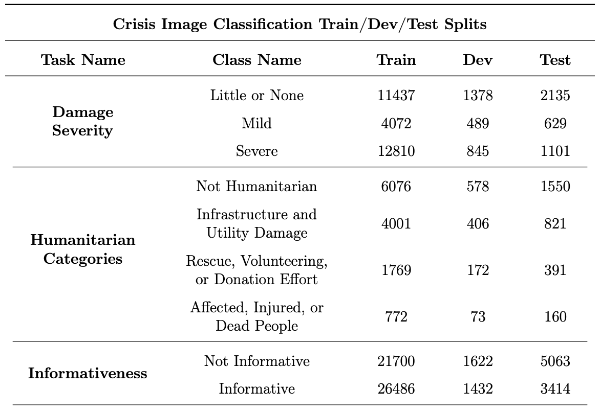

# Create Damage Severity, Humanitarian Categories, and Informativeness Train/Dev/Test Split Image Folders
  Use the `create_image_folders.ipynb` following the instructions below to create the train, dev, and test split image folders containing the images for the damage severity, humanitarian categories, and informativeness datasets as provided [here](https://crisisnlp.qcri.org/crisis-image-datasets-asonam20). This resulting folder structure which yields the image folders for damage severity, humanitarian categories, and informativeness can be seen in the markdown below, i.e. the created `./CCID Splits Data/damage_severity`, `./CCID Splits Data/humanitarian_categories`, and `./CCID Splits Data/informativeness` directories.

The `create_image_folders.ipynb` notebook requires Python version >=3.6 and [pipenv](https://pypi.org/project/pipenv/) installed

From the terminal:
1. Once `pipenv` is installed, run: `pipenv install ipykernel`
2. Activate your virtual environment with `pipenv`, by running `pipenv shell`
3. Create project kernel: `python -m ipykernel install --user --display-name [name-of-your-kernel] --name [name-of-your-kernel]`
4. Launch Jupyter notebook with `jupyter notebook` command and make sure to select the `[name-of-your-kernel]` kernel.

In the Notebook:

5. Run the entirety of the `create_image_folders.ipynb` notebook to generate the `./CCID Splits Data` folder, which contains the `damage_severity`, `humanitarian_categories`, and `informativeness` folders, which each have a folder structure (`train`, `dev`, & `test`) that can be used by the convenient `ImageFolder` class in PyTorch, namely:
```
.
├── crisis_vision_benchmarks            # Folder containing original split .tsv's and original images from [1]
├── CCID Splits Data                    # Folder containing task-specific train/dev/test split folders
│   ├── damage_severity 
│   │   ├── train                       # ImageFolder containing labeled images by directory
│   │   │   ├── little_or_none
│   │   │   ├── mild
│   │   │   └── severe
│   │   ├── dev
│   │   ├── test
│   │   ├── train.csv                   # csv containing original image paths in ./crisis_vision_benchmarks and new path in ./CCID Splits Data
│   │   ├── dev.csv
│   │   └── test.csv 
│   ├── humanitarian_categories          
│   └── informativeness
└── ...             
``` 

The expected image counts for each task folder are shown below:


**IMPORTANT NOTE:**

By using these constructed datasets you are agreeing to comply with the terms of use of the original data sourcers (namely these [Terms of Use](https://crisisnlp.qcri.org/terms-of-use.html)) and Twitter's Terms of Service, Privacy Policy, Development Agreement, and Developer Policy which can be found [here](https://developer.twitter.com/en/developer-terms/agreement-and-policy).

**Please cite the following sources if you are using these datasets in your research**:

## References
---
[1] ***Firoj Alam, Ferda Ofli, Muhammad Imran, Tanvirul Alam, Umair Qazi, [Deep Learning Benchmarks and Datasets for Social Media Image Classification for Disaster Response](https://arxiv.org/pdf/2011.08916.pdf), In 2020 IEEE/ACM International Conference on Advances in Social Networks Analysis and Mining (ASONAM), 2020.***
```
@inproceedings{crisisdataset2020-images,
Author = {Firoj Alam and Ferda Ofli and Muhammad Imran and Tanvirul Alam and Umair Qazi},
Keywords = {Social Media, Crisis Computing, Tweet Text Classification, Disaster Response},
Title = {Deep Learning Benchmarks and Datasets for Social Media Image Classification for Disaster Response},
Publisher = {IEEE},
Booktitle = {2020 IEEE/ACM International Conference on Advances in Social Networks Analysis and Mining (ASONAM)},
Year = {2020}
}
```

[2] ***Firoj Alam, Ferda Ofli, and Muhammad Imran, [CrisisMMD: Multimodal Twitter Datasets from Natural Disasters](https://arxiv.org/pdf/1805.00713.pdf). In Proceedings of the 12th International AAAI Conference on Web and Social Media (ICWSM), 2018, Stanford, California, USA.***
```
@InProceedings{crisismmd,
  author = {Alam, Firoj and Ofli, Ferda and Imran, Muhammad},
  title = { CrisisMMD: Multimodal Twitter Datasets from Natural Disasters},
  booktitle = {Proceedings of the 12th International AAAI Conference on Web and Social Media (ICWSM)},
  year = {2018},
  month = {June},
  date = {23-28},
  location = {USA}}
```
[3] ***Hussein Mozannar, Yara Rizk, and Mariette Awad, [Damage Identification in Social Media Posts using Multimodal Deep Learning](http://idl.iscram.org/files/husseinmouzannar/2018/2129_HusseinMouzannar_etal2018.pdf), In Proc. of ISCRAM, May 2018, pp. 529–543***
```
 @inproceedings{multimodal-deep-learning, title={Damage Identification in Social Media Posts using Multimodal Deep Learning}, booktitle={ISCRAM 2018 Conference Proceedings – 15th International Conference on Information Systems for Crisis Response and Management}, author={Mouzannar, Hussein and Yara Rizk and Awad, Mariette}, year={2018}, pages={529--543}} 
```
