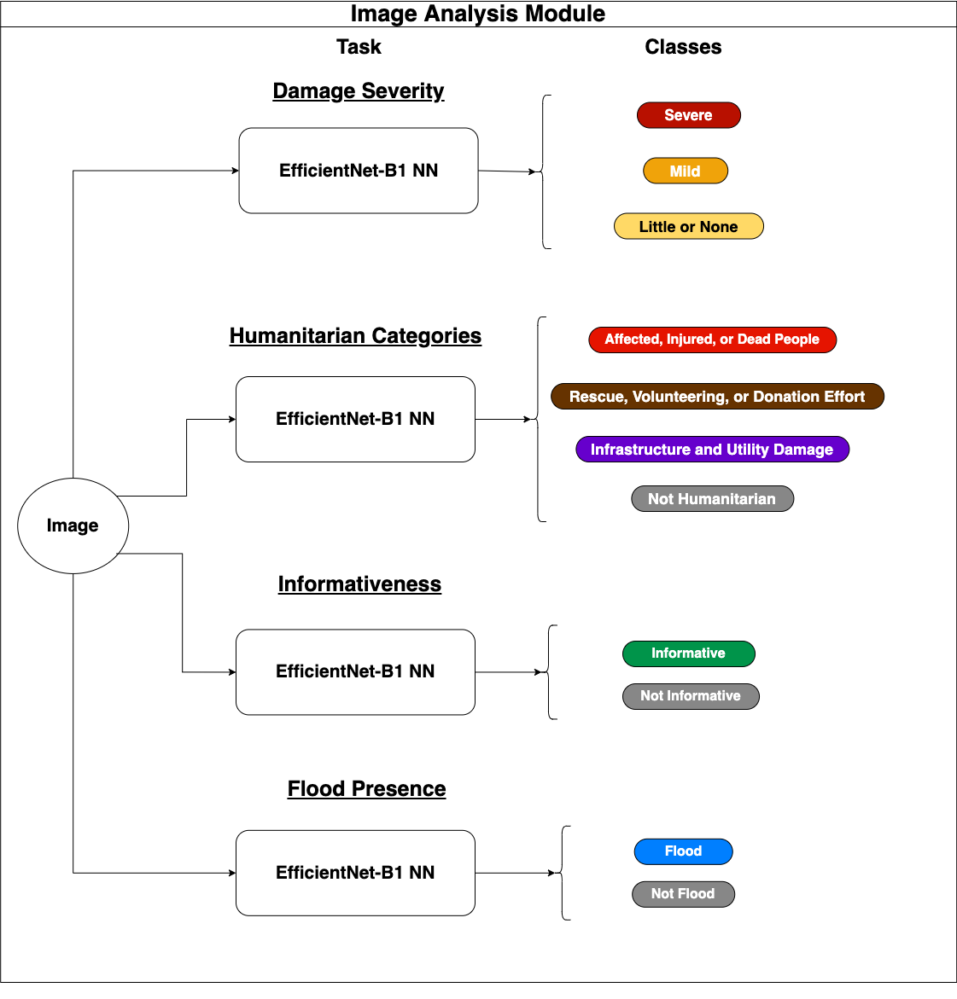

# **Image Analysis Module**


### **URL Image Analysis Module Python Package**
The URL Image Module Python package is used throughout the Jupyter notebooks we developed in our image analysis and is open-sourced under the Apache 2.0 License. This package is available on PyPI [here](https://pypi.org/project/url-image-module). The package repository can be found [here](https://gitlab.com/react76/url-image-module). We note that we used [version 0.27.0](https://pypi.org/project/url-image-module/0.27.0/) of the package in this work.

### **Image Analysis Methodology -- Training, Annotation, Analysis, and Evaluation in Fukuchiyama City, Japan**
Below we list the order & purpose of various notebooks used for conducting our analysis on crisis image data from Fukuchiyama City, Japan. This includes constructing datasets/image folders, training models, conducting image annotation on Fukuchiyama images, interannotator agreement analysis, and testing of models.

**IMPORTANT NOTES:** 
* We are unable to open-source the image data we were provided by our partners in Fukuchiyama, however the utilities we developed for conducting our analysis and experiments are reusable and are open-sourced for use in future work. We aim to demonstrate these developed utilities in the notebooks described below.
* Some of these notebooks were run on a Google Colab machine, others were run locally. This is indicated by whether or not the following code is the first cell in the notebook:
```
from google.colab import drive
drive.mount('/content/drive')
```


### **Constructing Datasets from Open-source Data Sources**
---

1. Creates Train/Dev/Test Image Folders from open-source crisis image data for the **Damage Severity (DS), Humanitarian Categories (HC), and Informativeness (IN)** tasks.
    - Directory: [./DS, HC, IN Image Split Folder Creation](https://github.com/dyllew/towards-automated-assessment-of-crowdsourced-crisis-reporting/tree/main/Image%20Analysis%20Module/DS%2C%20HC%2C%20IN%20Image%20Split%20Folder%20Creation)
    - Notebook: [./DS, HC, IN Image Split Folder Creation/create_image_folders.ipynb](https://github.com/dyllew/towards-automated-assessment-of-crowdsourced-crisis-reporting/blob/main/Image%20Analysis%20Module/DS%2C%20HC%2C%20IN%20Image%20Split%20Folder%20Creation/create_image_folders.ipynb)
2. Combines various open-source data sources with Flood-adjacent labels to form the larger **Flood Presence (FP)** task Train/Dev/Test splits & Image Folders.
    - Directory: [./Flood Presence Dataset Creation](https://github.com/dyllew/towards-automated-assessment-of-crowdsourced-crisis-reporting/tree/main/Image%20Analysis%20Module/Flood%20Presence%20Dataset%20Creation)
    - Notebook: [./Flood Presence Dataset Creation/make_flood_presence_dataset.ipynb](https://github.com/dyllew/towards-automated-assessment-of-crowdsourced-crisis-reporting/blob/main/Image%20Analysis%20Module/Flood%20Presence%20Dataset%20Creation/make_flood_presence_dataset.ipynb)

### **Training CNNs for the DS, HC, IN, and FP Tasks**
---
3. Uses image folders created in the above steps, specifically the folders for the training and dev sets, to train models to perform the DS, HC, IN, and FP tasks. Contains base training code and derivative notebooks to enable training in parallel on hosts with GPU hardware on Google Colab.
    - Directory: [./Training Image Models](https://github.com/dyllew/towards-automated-assessment-of-crowdsourced-crisis-reporting/tree/main/Image%20Analysis%20Module/Training%20Image%20Models)
    - Notebook: [./Training Image Models/Train_Model_Base.ipynb](https://github.com/dyllew/towards-automated-assessment-of-crowdsourced-crisis-reporting/tree/main/Image%20Analysis%20Module/Training%20Image%20Models/Train_Model_Base.ipynb)
    - Misc: [./Training Image Models/For Training in Parallel](https://github.com/dyllew/towards-automated-assessment-of-crowdsourced-crisis-reporting/tree/main/Image%20Analysis%20Module/Training%20Image%20Models/For%20Training%20in%20Parallel) contains training notebooks for each task to enable training in parallel on Google Colab.
4. Saved Trained Image Models for each task with trained weights, hyperparameters, training host's settings, etc. which can be used to load a trained model to use in evaluation or for prediction on new, unseen data.

    - Directory: [./Trained Image Models](https://github.com/dyllew/towards-automated-assessment-of-crowdsourced-crisis-reporting/tree/main/Image%20Analysis%20Module/Trained%20Image%20Models) 

### **Annotating Images from Fukuchiyama City Flood Crisis Context**
---
5. Images from Fukuchiyama were labeled for each of the mentioned tasks using a guide which contained descriptions for each class of a task and an associated example image for that task
    - Directory: [./Annotation](https://github.com/dyllew/towards-automated-assessment-of-crowdsourced-crisis-reporting/tree/main/Image%20Analysis%20Module/Annotation)
    - Labeling Guide: [./Annotation/Image Labeling Guide.docx](https://github.com/dyllew/towards-automated-assessment-of-crowdsourced-crisis-reporting/blob/main/Image%20Analysis%20Module/Annotation/Image%20Labeling%20Guide.docx)


6. A base labeling CSV where each row corresponds to an image and each column corresponds to a task & unique annotator, to be filled out by multiple annotators can be constructed using a directory of image files and list of task names by running the script located [here](https://gitlab.com/react76/url-image-module/-/blob/988c674fc543e2fc740021bbe86d230213a8a34e/src/url_image_module/make_image_labeling_csv.py).

### **Cleaning, Exploratory Data Analysis (EDA), and Ground-truthing of Fukuchiyama Images & Annotations**
---
- Directory: [./Cleaning, EDA, Ground-Truthing FC Data](https://github.com/dyllew/towards-automated-assessment-of-crowdsourced-crisis-reporting/tree/main/Image%20Analysis%20Module/Cleaning%2C%20EDA%2C%20Ground-Truthing%20FC%20Data)

7. Cleans Fukuchiyama image labels CSV, e.g. removing rows which are empty, updating paths to files on the host which has the images in its filesystem, dropping irrelevant columns, dropping rows which have not been labeled by all of the annotators for each task

    - Notebook: [./Cleaning, EDA, Ground-Truthing FC Data/Clean_Image_Labels.ipynb](https://github.com/dyllew/towards-automated-assessment-of-crowdsourced-crisis-reporting/blob/main/Image%20Analysis%20Module/Cleaning%2C%20EDA%2C%20Ground-Truthing%20FC%20Data/Clean_Image_Labels.ipynb)

8. Performs analysis on the training datasets mentioned in steps 1. & 2. showing distributions of the labels for each task. Computes interannotator agreement statistics on the annotations given to the Fukuchiyama images. Finally, using the plurality label (if one exists) given to each image for each task, a ground-truth label is given to the image for that task, forming the ground-truth datasets for each task to be used for evaluation/testing.

    - Notebook: [./Cleaning, EDA, Ground-Truthing FC Data/EDA_&_Ground_Truthing_FC_Image_Labels.ipynb](https://github.com/dyllew/towards-automated-assessment-of-crowdsourced-crisis-reporting/blob/main/Image%20Analysis%20Module/Cleaning%2C%20EDA%2C%20Ground-Truthing%20FC%20Data/EDA_%26_Ground_Truthing_FC_Image_Labels.ipynb)
    - Misc: Associated plots for the EDA can be found [here](https://github.com/dyllew/towards-automated-assessment-of-crowdsourced-crisis-reporting/tree/main/Image%20Analysis%20Module/Plots/Exploratory%20Data%20Analysis) showing the label distributions for the ground-truth Fukuchiyama images ([./Plots/Exploratory Data Analysis/Fukuchiyama Data Distributions](https://github.com/dyllew/towards-automated-assessment-of-crowdsourced-crisis-reporting/tree/main/Image%20Analysis%20Module/Plots/Exploratory%20Data%20Analysis/Fukuchiyama%20Data%20Distributions)) and the training data mentioned above ([./Plots/Exploratory Data Analysis/Training Sets Data Distributions](https://github.com/dyllew/towards-automated-assessment-of-crowdsourced-crisis-reporting/tree/main/Image%20Analysis%20Module/Plots/Exploratory%20Data%20Analysis/Training%20Sets%20Data%20Distributions))

### **Creating Image Folders for ground-truth Fukuchiyama datasets for DS, HC, IN, and FP Tasks for Evaluation**
---
9. Using the ground-truth labels given to each image from Fukuchiyama from step 8. above, this notebook creates image folders for each task which can be used for evaluation.
    - Directory: [./FC Image Folders Creation](https://github.com/dyllew/towards-automated-assessment-of-crowdsourced-crisis-reporting/tree/main/Image%20Analysis%20Module/FC%20Image%20Folders%20Creation)
    - Notebook: [./FC Image Folders Creation/make_image_folders_from_ground_truth_FC_data.ipynb](https://github.com/dyllew/towards-automated-assessment-of-crowdsourced-crisis-reporting/blob/main/Image%20Analysis%20Module/FC%20Image%20Folders%20Creation/make_image_folders_from_ground_truth_FC_data.ipynb)

### **Testing Image Models and Evaluation on Fukuchiyama Images**
---
10. Evaluates the trained models mentioned in step 4. on the test splits from step 1. & step 2. Evaluates images on the Fukuchiyama datasets from step 9. Saves evaluation results in the respective model directories. Computes a variety of performance metrics for the models on the various test sets. Additionally, plots confusion matrices and per-class metric bar plots of the evaluation results.
    - Directory: [./Testing Image Models](https://github.com/dyllew/towards-automated-assessment-of-crowdsourced-crisis-reporting/tree/main/Image%20Analysis%20Module/Testing%20Image%20Models)
    - Notebook: [./Testing Image Models/Test_Models.ipynb](https://github.com/dyllew/towards-automated-assessment-of-crowdsourced-crisis-reporting/tree/main/Image%20Analysis%20Module/Testing%20Image%20Models/Test_Models.ipynb)
    - Misc: Associated plots for the evaluation of the models on the Fukuchiyama images can be found [here](https://github.com/dyllew/towards-automated-assessment-of-crowdsourced-crisis-reporting/tree/main/Image%20Analysis%20Module/Plots/Classification%20Results) showing the confusion matrix and the per-class performance bar plot for each model.


### **Fukuchiyama Prediction & Annotation Review**
---
11. Uses trained models from step  4. to make and save predictions on all of the Fukuchiyama images.
    - Directory: [./Predictions on FC Data](https://github.com/dyllew/towards-automated-assessment-of-crowdsourced-crisis-reporting/tree/main/Image%20Analysis%20Module/Predictions%20on%20FC%20Data)
    - Notebook: [./Predictions on FC Data/Predictions_on_FC_Data.ipynb](https://github.com/dyllew/towards-automated-assessment-of-crowdsourced-crisis-reporting/blob/main/Image%20Analysis%20Module/Predictions%20on%20FC%20Data/Predictions_on_FC_Data.ipynb)

12. Creates folders corresponding to different results of the annotation, e.g. folder of images for a task which had complete agreement, complete disagreement, etc. between annotators as well as folders comparing model predictions from step 11. against annotation results. These folders were useful in the selection of images for the image annotation workshops held with various EOC as well as in pinpointing ambigious examples for each class of a task in order to resolve disagreements between annotators and refine class definitions for a task. 
    - Directory: [./FC Images Labeling Review](https://github.com/dyllew/towards-automated-assessment-of-crowdsourced-crisis-reporting/tree/main/Image%20Analysis%20Module/FC%20Images%20Labeling%20Review)
    - Notebook: [./FC Images Labeling Review/Predictions_on_FC_Data.ipynb](https://github.com/dyllew/towards-automated-assessment-of-crowdsourced-crisis-reporting/blob/main/Image%20Analysis%20Module/FC%20Images%20Labeling%20Review/make_labeling_review_folders_for_FC_img_data.ipynb)

Diagram of the Image Analysis Module:
